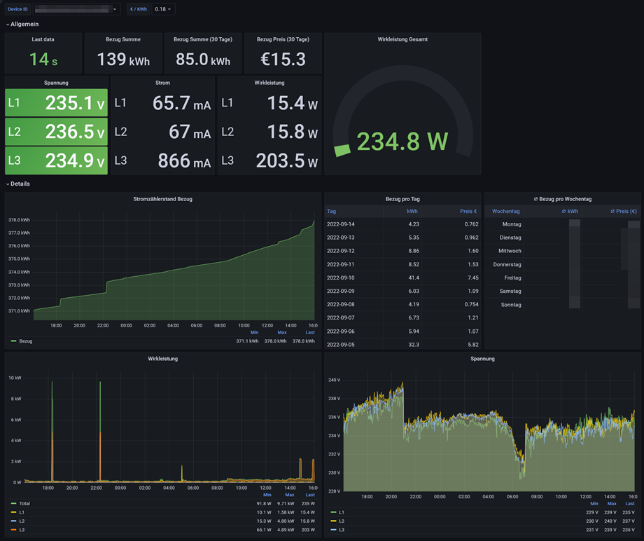
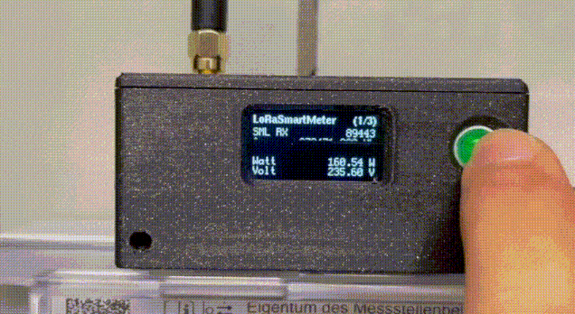
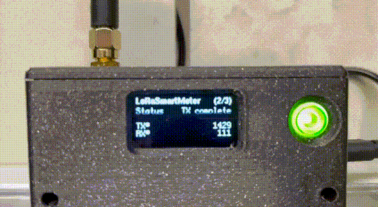
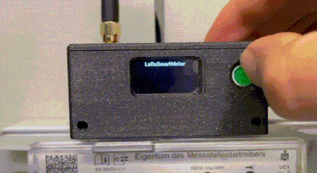
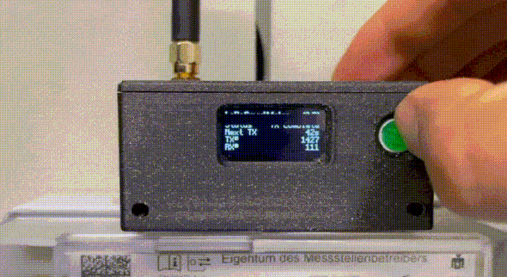
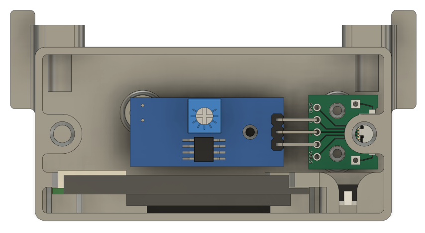
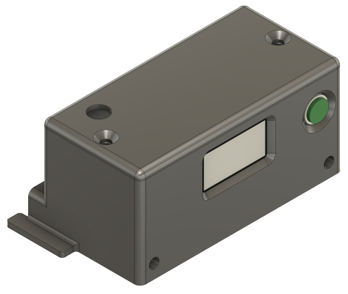

# LoRaSmartMeter

This adapter reads an SML compatible electricity meter via IR interface and transmits the values via LoRaWAN to a database and a Grafana Dashboard. A LED indicates if a SML message was successfully decoded. After entering a PIN, the values can be displayed on the display and the status of the LoRa transmission can be checked. If the button is pressed for more than 10 seconds, WiFi is activated and the firmware can be updated OTA. 

The centerpiece is a [TTGO LoRa32 V1.0](https://s.click.aliexpress.com/e/_Dknm4wL) board. As IR reciver i use a [TCRT5000 Sensor Module](https://s.click.aliexpress.com/e/_Dk6yYZZ), where I removed the ceramic capacitor parallel to the phototransistor and replaced the resistor in the collector circuit of the phototransistor by one with 1KOhm (see [here](https://forum.iobroker.net/post/386478)). The potientiometer needs to be adjusted later, until the serial output of the SML messages is readable.

Tested with the following meters:
 - EasyMeter Q3A
 - eBZ DD3 2R06 ETA SMZ1

I constructed a case, which works for both meters. The case is designed to be printed on a 3D printer and can be found on  [Printables.com](https://www.printables.com/model/276254-easymeter-q3a-lorawan-smartmeter).

## Impressions
### Grafana Dashboard



### Usage






### Case




## Flags

| Build Flag  | function                                                        |
| ----------- | --------------------------------------------------------------- |
| `LORA_OFF`  | Disable LoRa function                                           |
| `FAKE_SML`  | Parse a static test SML-Message every second and turns LoRa off |
| `SML_DEBUG` | Turn debug messages from SML parser lib on                      |

## Payload Decoder

```javascript
function decodeUplink(input) {
  var bytes = input.bytes;

  var version = (bytes[0] >> 4) + "." + (bytes[0] & 0xf); // Firmware version
  var activePosEnergyTotal = readInt(bytes, 1);
  var activeNegEnergyTotal = readInt(bytes, 9);
  var sumActivePower = readInt(bytes, 17, 4);
  var sumActivePowerL1 = readInt(bytes, 21, 4);
  var sumActivePowerL2 = readInt(bytes, 25, 4);
  var sumActivePowerL3 = readInt(bytes, 29, 4);
  var voltageL1 = readInt(bytes, 33, 4); 
  var voltageL2 = readInt(bytes, 37, 4); 
  var voltageL3 = readInt(bytes, 41, 4); 

  return {
    data: {
      version: version,
      activePosEnergyTotal: activePosEnergyTotal,
      activeNegEnergyTotal: activeNegEnergyTotal,
      sumActivePower: sumActivePower,
      sumActivePowerL1: sumActivePowerL1,
      sumActivePowerL2: sumActivePowerL2,
      sumActivePowerL3: sumActivePowerL3,
      voltageL1: voltageL1,
      voltageL2: voltageL2,
      voltageL3: voltageL3
    },
    warnings: [],
    errors: [],
  };
}

function readInt(array, start, size = 8) {
  var value = 0;
  var first = true;
  var pos = start;
  while (size--) {
    if (first) {
      let byte = array[pos++];
      value += byte & 0x7f;
      if (byte & 0x80) {
        value -= 0x80; // Treat most-significant bit as -2^i instead of 2^i
      }
      first = false;
    } else {
      value *= 256;
      value += array[pos++];
    }
  }
  return value;
}
```

## Links

- [olliiiver/sml_parser: C++ library to parse Smart Message Language (SML) data from smart meters.](https://github.com/olliiiver/sml_parser)
- [Smartmeter D0, SML](https://www.msxfaq.de/sonst/bastelbude/smartmeter_d0_sml.htm)
- [Smart Message Language — Stromzähler auslesen – Die Schatenseite](https://www.schatenseite.de/2016/05/30/smart-message-language-stromzahler-auslesen)
- [Volkszähler TTL Schreib- Lesekopf für Digitale Stromzähler](https://forum.iobroker.net/post/386478)
- [BSI - Bundesamt für Sicherheit in der Informationstechnik - BSI TR-03109-1 Anlage IVb: Feinspezifikation "Drahtgebundene LMN-Schnittstelle" Teil b: "SML – Smart Message Language"](https://www.bsi.bund.de/SharedDocs/Downloads/DE/BSI/Publikationen/TechnischeRichtlinien/TR03109/TR-03109-1_Anlage_Feinspezifikation_Drahtgebundene_LMN-Schnittstelle_Teilb.html)
- [SML-Interface](https://www.stefan-weigert.de/php_loader/sml.php)
- [Tasmota - Smart-Meter-Interface](https://tasmota.github.io/docs/Smart-Meter-Interface/)

## Disclaimer
The links to Shops are advertising links. I would be happy if you use this link, but of course you don't have to. I have linked exactly the offers from which I have also bought and was satisfied with the supplier and the goods. The products can of course be bought anywhere.